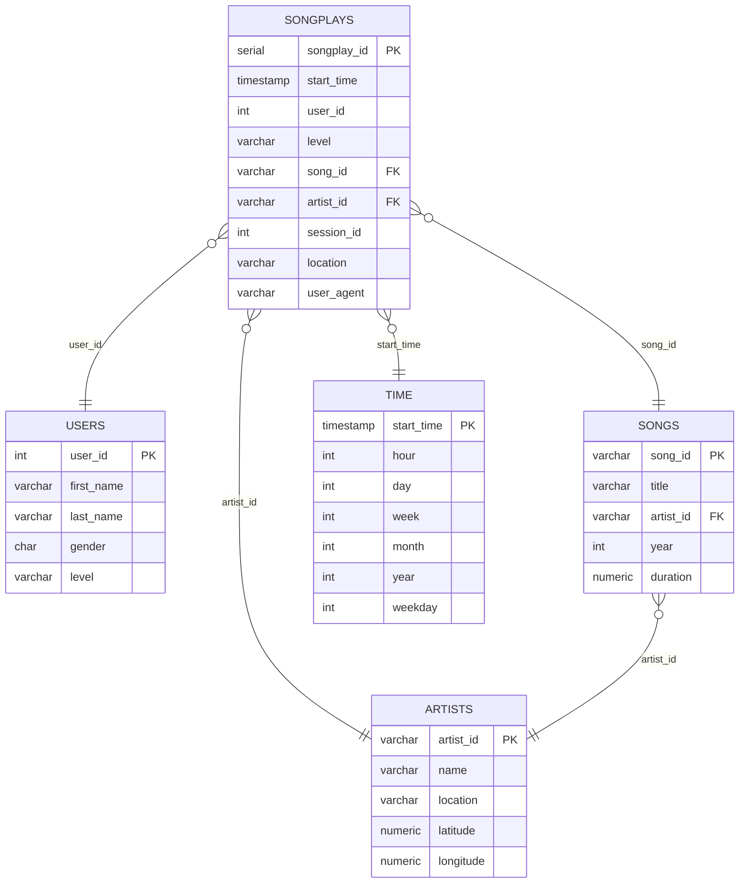
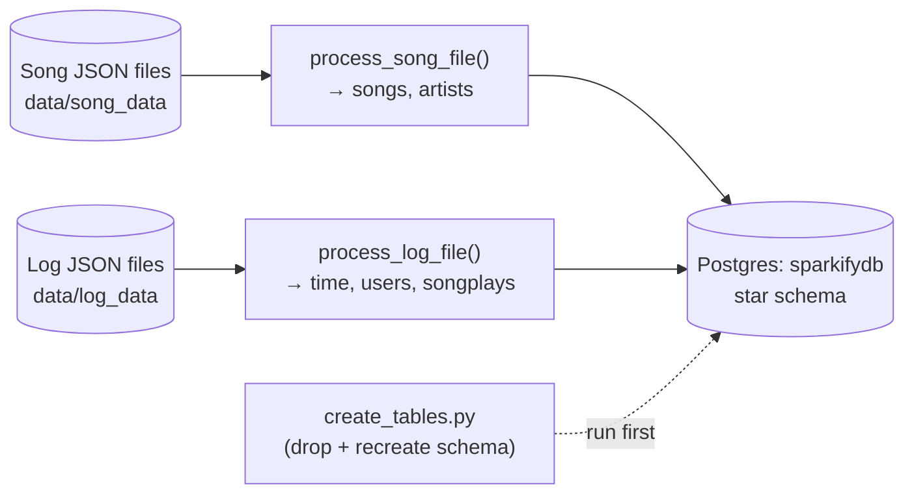

# Data Modeling with Postgres: Sparkify ETL Pipeline

A star-schema data warehouse and ETL pipeline that transforms raw JSON activity logs and song metadata into a queryable Postgres database — built to answer the question: **what are Sparkify's users actually listening to?**

> **Note:** This is a Udacity Data Engineering Nanodegree project ("Data Modeling with Postgres"), used to fulfill a WGU course requirement.

---

## Business Problem

Sparkify, a (fictional) music streaming startup, collects user activity and song metadata as raw JSON log files — but raw JSON isn't queryable in any meaningful way. The startup's analytics team wants to answer practical questions like *which songs are most played, by which users, on which subscription tier* — questions that require structured, relational data, not scattered log files.

This project builds the data infrastructure to make that possible: an ETL (Extract, Transform, Load) pipeline that reads the raw JSON song and log data and loads it into a **Postgres star schema** purpose-built for fast, simple analytical queries — the kind of foundation any data/analytics team needs before dashboards or ad-hoc SQL analysis are even possible.

---

## Dataset

Two raw JSON datasets are used as ETL source data:

**Song dataset** — metadata for individual songs and their artists, partitioned by the first three letters of each song's track ID. Example record:
```json
{"artist_id": "ARD7TVE1187B99BFB1", "artist_latitude": null, "artist_location": "California - LA",
 "artist_longitude": null, "artist_name": "Casual", "duration": 218.93179, "num_songs": 1,
 "song_id": "SOMZWCG12A8C13C480", "title": "I Didn't Mean To", "year": 0}
```

**Log dataset** — simulated user activity logs (song plays, page views, sessions), partitioned by year and month. Example record:
```json
{"artist": "Stephen Lynch", "auth": "Logged In", "firstName": "Jayden", "gender": "M",
 "itemInSession": 0, "lastName": "Bell", "length": 182.85669, "level": "free",
 "location": "Dallas-Fort Worth-Arlington", "method": "PUT", "page": "NextSong",
 "registration": 1540992000000.0, "sessionId": 829, "song": "Jim Henson's Dead",
 "status": 200, "ts": 1543537327796, "userAgent": "Mozilla/5.0 ...", "userId": 91}
```

**Obtaining the data:** this dataset is the standard Udacity-provided Sparkify song/log dataset (itself a subset of the [Million Song Dataset](http://millionsongdataset.com/)). It is not included directly in this repository — it's expected to be available locally under `data/song_data` and `data/log_data` directory structures, per the original Udacity project setup.

---

## Technologies Used

- **Python**
- **PostgreSQL** — the target relational database
- **psycopg2** — Python–Postgres connectivity
- **pandas** — JSON parsing and data shaping during ETL
- **Jupyter Notebook** — `etl.ipynb` (single-file ETL development/testing) and `test.ipynb` (verifying loaded data)

---

## Architecture

This project uses a **star schema**, chosen specifically because: the data's natural structure fits it, the data volume doesn't warrant a Big Data solution, it makes aggregation simple for analysts, and it supports standard SQL joins.



- **`songplays`** is the **fact table** — one row per song-play event, linking to every dimension table.
- **`users`**, **`songs`**, **`artists`**, and **`time`** are the **dimension tables**, each describing one axis to slice the fact data by (who, what song, which artist, when).

**ETL flow:**


1. **`create_tables.py`** connects to Postgres, drops any existing tables, and creates the fact and dimension tables fresh (using the `CREATE TABLE` statements in `sql_queries.py`).
2. **`etl.py`** (built from `etl.ipynb`) walks the song and log data directories, processes each file with `process_song_file()` and `process_log_file()`, and inserts the resulting records into the appropriate tables using `INSERT` statements with `ON CONFLICT` handling to avoid duplicate-key errors on re-runs.
3. **`test.ipynb`** queries each table afterward to spot-check that data loaded correctly.

A notable design detail in `sql_queries.py`: the `users` table insert uses `ON CONFLICT (user_id) DO UPDATE SET level = EXCLUDED.level` — meaning if a user's subscription level changes between log entries (free → paid), the latest value wins rather than throwing a duplicate-key error.

---

## Setup and Execution

### Prerequisites
- Python 3.x
- PostgreSQL (running locally or accessible via connection string)

### Installation

```bash
git clone https://github.com/ZinnNotZen/Data-Modeling-with-Postgres.git
cd Data-Modeling-with-Postgres
pip install psycopg2-binary pandas jupyter
```

### Running the pipeline

1. Make sure PostgreSQL is running and you have a database connection configured (the project expects a `sparkifydb` database and a `studentdb` administrative database, per the standard Udacity setup).
2. Place the song and log JSON data under `data/song_data` and `data/log_data` respectively.
3. Create the schema (drops and recreates all tables):
   ```bash
   python create_tables.py
   ```
4. Run the ETL pipeline to populate the tables:
   ```bash
   python etl.py
   ```
5. Verify the load by opening `test.ipynb` in Jupyter and running its cells — it displays the first few rows of each table.

> If you modify the schema in `sql_queries.py`, re-run `create_tables.py` before re-running `etl.py`, since the tables are dropped and recreated each time `create_tables.py` runs.

---

## Sample Outputs

`test.ipynb` is the project's built-in verification step — running it displays the first rows of each table (`songplays`, `users`, `songs`, `artists`, `time`) so you can visually confirm the ETL loaded data correctly into the right shape.

A simple example analytical query this schema enables directly:
```sql
SELECT u.first_name, u.last_name, s.title, a.name AS artist
FROM songplays sp
JOIN users u ON sp.user_id = u.user_id
JOIN songs s ON sp.song_id = s.song_id
JOIN artists a ON sp.artist_id = a.artist_id
LIMIT 10;
```


---

## Key Findings and Lessons Learned

- **Star schemas trade some normalization for query simplicity.** Centralizing song-play events in a single fact table with foreign keys out to clean dimension tables makes typical analytics questions ("most played artist," "plays by subscription level") a straightforward join — much simpler than querying nested raw JSON directly.
- **Idempotent inserts matter for re-runnable pipelines.** Using `ON CONFLICT DO NOTHING` (or `DO UPDATE` for the `users` table) means the ETL script can be safely re-run against the same data without crashing on duplicate primary keys — an important property for any pipeline that might process overlapping data batches.
- **Not every fact has every dimension at insert time.** `song_id` and `artist_id` in `songplays` allow `NULL`, reflecting that the raw log data doesn't always have an exact song/artist match in the song dataset — the schema has to tolerate that gap rather than reject the row.
- **Separating fact and dimension processing by source file type kept the ETL logic clean.** `process_song_file()` handles song/artist data, while `process_log_file()` handles time/user/songplay data — splitting along the natural boundary in the source data, rather than trying to handle everything in one function.

---

## Possible Extensions

- Add data validation/quality checks before insert (e.g., reject rows with implausible duration or year values)
- Migrate the schema to a cloud data warehouse (e.g., Redshift or Snowflake) for larger-scale analytics, a natural next step also covered later in the Data Engineering Nanodegree track
- Add indexes on foreign key columns in `songplays` to optimize join performance as data volume grows
- Build a small set of pre-written analytical queries (most-played artists, plays by hour-of-day, free vs. paid listening patterns) as a deliverable on top of the schema itself
